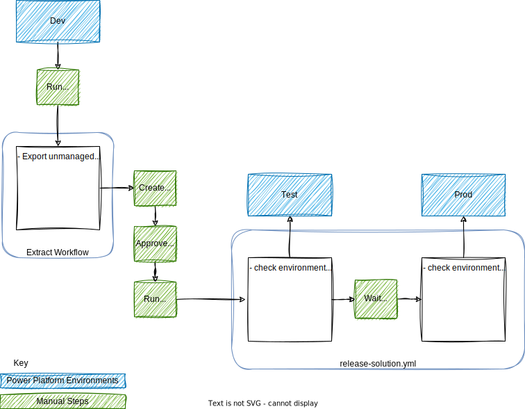
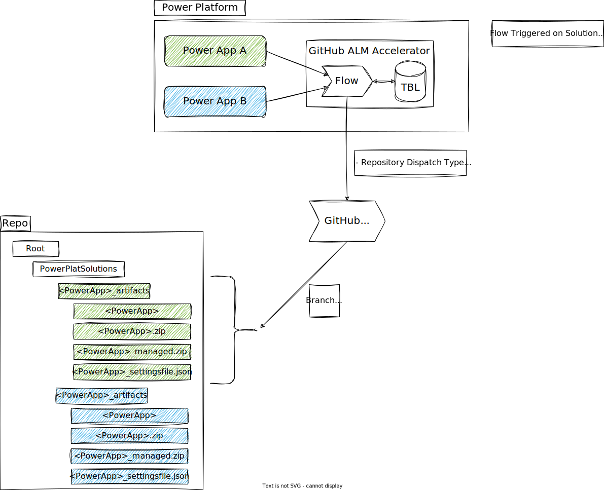
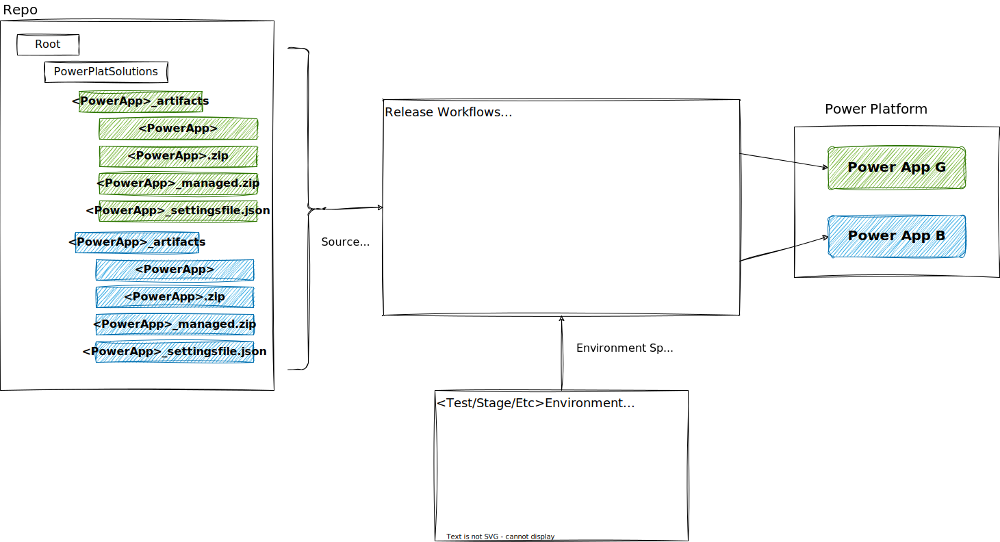
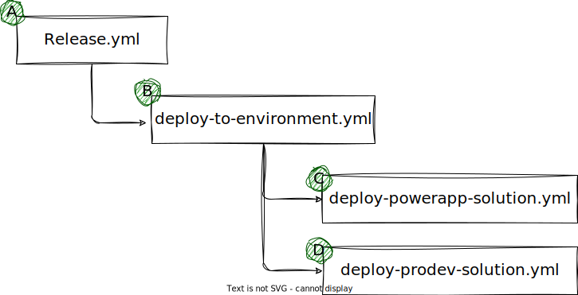

# GitHub Overview

## GitHub Workflow Overview

There are two processes at work.  The first part is exporting the PowerApp Solution from a tenant.  The export process can be kicked off manually as depicted in the diagram below as well as through a PowerApp Flow.  The second process releleases a PowerApp Solution(s) to a different tenant/environment(s) potentially alongside a pro dev solution.  

 

### Export Process Deep Dive
The repository is structured to support multiple Power App Solutions along with Pro Dev Solutions (not shown).  The powerPlatSolutions folder will contain one or more Power Platform Solutions.  Each Power Platform Solution has its own [name]_artifacts folder.  This is where you will find the unmanaged zip file, the managed zip file, the settings file, and a folder with the extracted solution.

While you can manually kick off the export process, a PowerApp and Flow has been provided which will help you manage your PowerApp Solutions and kick off the export process whenever a solution is versioned.  The GitHub workflow will run the solution checker then create a new branch with the zip files, settings file, and extracted solution.  Typically, a pull request is then used to merge these changes with the main branch.

 

### Release Process Deep Dive
The release process is setup to release all PowerApp Solutions to the target environments.  The workflows leverage GitHub Environments for environment configuration and is made up of three workflows.  The following diagram gives an overview of the process.

There are several workflow files used in the release process.  Each workflow can be manually dispatched if needed but they are designed to work together to create a single release process across all environments.

- A) this is the main release workflow.  It is manually dispatched and will iterate over your environments with a matrix strategy.  In this case, it will deploy your solutions to both the test and production environments.

- B) the deploy-to-environment workflow will deploy all solutions to a single environment.  For this demo, it will deploy two PowerApp Solutions and run a placeholder workflow to demonstrate where you would deploy your pro developer solution.  NOTE: The PowerApp Solutions are hard coded in this workflow as are the variables containing the SettingsFile contents.  This was necessary since you cannot dynamically fetch a variable.

- C) here we deploy a PowerApp Solution.  Values are both passed to the workflow and retreived from the environment.  There are flags that determine whether to deploy an unmanaged or managed version of the solution as well as whether a consistency check should be run.  NOTE: The entire settings file json contents are stored in an environment variable.

- D) this is simply a placeholder for any pro developer solutions that need to be deployed alongside the PowerApp.

### GitHub Environment Variables
While there is a "Dev" environment configured, it is only used by the extract workflow.  The release workflow will not deploy to the development environment to help prevent inadvertantly overwritting PowerApp Solution in your Dev Environment and losing changes.

Other environments, Test, Prod, etc. will need a SettingsFile variable per PowerApp solution being managed, a Check_Consistency Flag, a Deploy_Managed flag, and an Environment_URL.  Currently CLient_ID and Tenant_ID are variables but will be moved to secrets in the future.  Additionally, the PowerPlatformSPN (secret) will be moved from a repository secret to an environment secret.

### Setup Notes
Once you have your environments in place, modify the release.yml file matrix to deploy to your environments, line 15.  NOTE: this is case sensitive.

When you add a new PowerApp Solution, make sure you add a new <app>_SettingsFile variable in all environments containing the updated settingsfile contents specific to that environment.  Then add a new workflow call in the depoy-to-environment.yml file to deploy the solution.